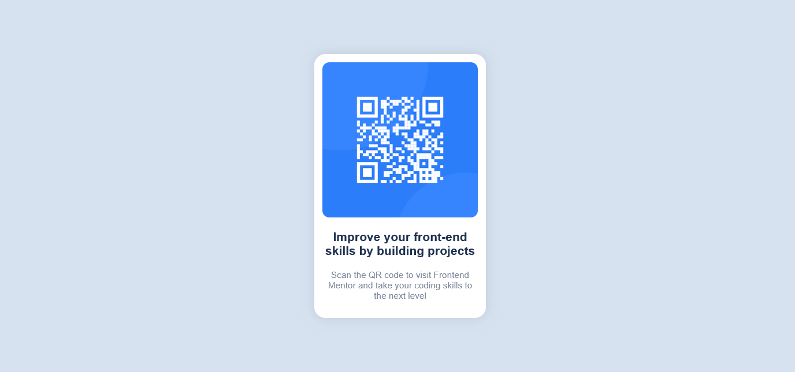

# Frontend Mentor - QR code component solution

This is a solution to the [QR code component challenge on Frontend Mentor](https://www.frontendmentor.io/challenges/qr-code-component-iux_sIO_H). 

## Table of contents

- [Overview](#overview)
  - [Screenshot](#screenshot)
  - [Links](#links)
- [My process](#my-process)
  - [Built with](#built-with)
  - [What I learned](#what-i-learned)
  - [Continued development](#continued-development)
- [Author](#author)

**Note: Delete this note and update the table of contents based on what sections you keep.**

## Overview

  I'm the beginner of Web development. So, I used only HTML and CSS to solve this challenge without any frameworks or libraries.

  Any suggestion to improve my code are welcome!

### Screenshot




### Links

- Solution URL: [Add solution URL here](https://your-solution-url.com)
- Live Site URL: [Add live site URL here](https://your-live-site-url.com)

## My process

- I used qrcode_component_coontainer to hold qrcode_component. Both /of them are flex-box.
- I use variable to store default value in CSS.


### Built with

- HTML5 markup
- CSS custom properties
- Flexbox

### What I learned

- I have learned How to use variables in CSS.
```css
  --font-color: hsl(218, 44%, 22%);
```
Variable start with -- and it seems like other properties in CSS.

- I have learned how to use flex, escpecially flex-grow, flex-shrink and flex-basis. **flex-grow and flex-shrink won't be applied same time.**
```css
  flex: flex-grow flex-shrink flex-basis
```

### Continued development

- I want to focus on how to use DRY principle in CSS. I used classes to describe in CSS, but I need to focus what to use where.

- I want to learn to use frameworks to enhance better perfomance in CSS.


## Author

- Frontend Mentor - [@Dhahira](https://www.frontendmentor.io/profile/DhahiraThesneem)


